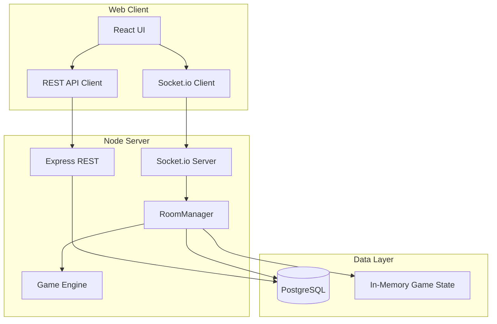

# 架构说明

## 总体架构

## Monorepo 包职责

### `@game-lobby/shared`

- 游戏类型、房间状态、AI 难度等 TypeScript 类型
- `GAME_META`：各游戏名称、人数上下限、描述
- 前后端共用，避免类型漂移

### `@game-lobby/db`

- Drizzle ORM Schema：`users`、`rooms`、`room_members`、`room_game_queue`、`game_sessions`
- `createDb()` 工厂函数，供服务端注入

### `@game-lobby/game-engine`

- 纯函数游戏逻辑，不依赖 IO
- `谁是卧底`：发词、描述、投票、胜负判定
- `达芬奇密码`：发牌、抽牌、猜测对手暗牌、翻牌出局判定、按视角脱敏
- 电脑 AI：基于难度的随机/失误策略

### `@game-lobby/server`

- **REST**：注册、登录、房间列表/创建/详情
- **WebSocket**：大厅订阅、房间加入、游戏操作、实时广播
- **RoomManager**：房间生命周期、队列、角色分配、游戏会话

### `@game-lobby/web`

- 登录/注册页
- 游戏大厅（房间卡片列表）
- 房间页（玩家管理、队列、游戏 UI）
- CSS 变量 + 响应式 Grid/Flex 布局

## 实时通信事件

| 事件 | 方向 | 说明 |
|------|------|------|
| `lobby:subscribe` | C→S | 订阅大厅房间列表 |
| `lobby:rooms` | S→C | 广播房间摘要 |
| `room:join` | C→S | 加入房间 |
| `room:updated` | S→C | 房间详情更新 |
| `room:add-bot` | C→S | 房主添加电脑 |
| `room:update-queue` | C→S | 更新游戏队列 |
| `room:set-roles` | C→S | 设置玩家/旁观 |
| `game:start` | C→S | 房主开始下一局 |
| `game:state` | S→C | 游戏状态同步（达芬奇按玩家视角脱敏单独下发） |
| `game:undercover:*` | C→S | 卧底描述/投票 |
| `game:davinci:guess` | C→S | 达芬奇猜测对手暗牌 |
| `game:davinci:decision` | C→S | 达芬奇猜中后继续/停止 |

## 数据持久化策略

- **持久化**：用户、房间元数据、成员、游戏队列
- **内存**：进行中的游戏状态（`RoomManager.games` Map）
  - 适合实时对战，重启后需重新开局
  - 后续可扩展写入 `game_sessions.state_json`

## 鉴权

- REST：`Authorization: Bearer <JWT>`
- Socket：握手 `auth.token`
- JWT payload：`sub`（userId）、`username`

## 扩展新游戏

1. 在 `shared` 添加 `GameType` 与 `GAME_META`
2. 在 `game-engine` 实现 `createXxxGame` 与操作函数
3. 在 `RoomManager` 注册创建与处理逻辑
4. 在 `socket/index.ts` 添加事件处理
5. 在 `web` 添加游戏 UI 组件
