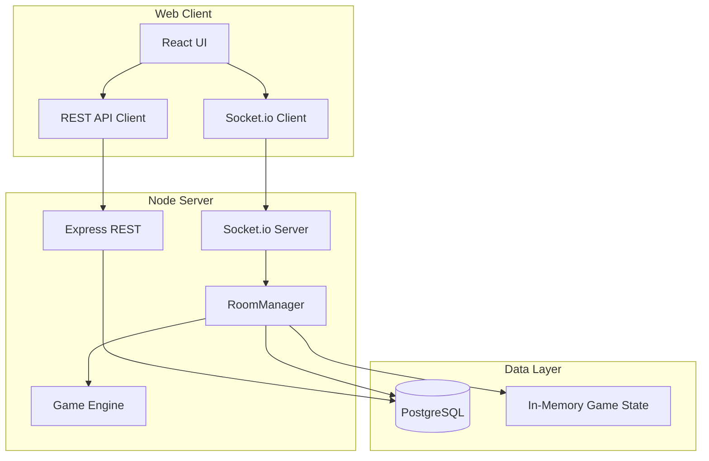

# 架构说明

## 总体架构



## 包结构（游戏隔离）

```
packages/
  shared/              # GameType, GAME_META, 房间类型
  game-core/           # GameModule 接口、BotContext、ai/utils
  games/
    undercover/        # @game-lobby/game-undercover + logic.test.ts
    da-vinci-code/     # @game-lobby/game-da-vinci-code + logic.test.ts
    _template/         # 新游戏脚手架说明
  game-engine/         # gameRegistry 聚合 + re-export
  db/

apps/
  server/src/games/    # 每游戏 socket 注册
  web/src/games/       # 每游戏 UI + registry.tsx
```

### 依赖关系

- 各游戏包只依赖 `game-core` + `shared`，**互不 import**
- `game-engine` 聚合所有游戏模块，供 `server` / `web` 使用
- `server` / `web` **不直接**依赖各 `game-*` 包

## 导航与大厅结构

- 主页展示所有游戏卡片（`ALL_GAME_TYPES`）
- 游戏大厅仅显示该 `gameType` 的房间
- 房间绑定单一游戏，局间可再来一局

## Monorepo 包职责

### `@game-lobby/shared`

- `GameType`、`GAME_META`（含 `botsAllowed`、`requiresPerPlayerState`）
- `GAME_TYPE_ZOD_VALUES` 供 Zod enum 单一来源

### `@game-lobby/game-core`

- `GameModule` 接口：`create`、`isEnded`、`projectState`、`runBotTurn`、`preStartSpectatorIds`
- 共享 AI 工具：`pickRandom`、`shuffle`、`shouldBotMakeMistake`

### `@game-lobby/game-undercover` / `@game-lobby/game-da-vinci-code`

- 纯函数 `logic.ts` + `module.ts`（实现 GameModule）
- Vitest 单测：`pnpm --filter @game-lobby/game-undercover test`

### `@game-lobby/game-engine`

- `gameRegistry` + `createGame` / `isGameEnded` / `projectGameState`
- 对外 re-export 各游戏类型与 reducer

### `@game-lobby/server`

- **RoomManager**：通用房间与游戏生命周期，通过 `gameRegistry` 调用游戏逻辑
- **apps/server/src/games/**：每游戏 socket 事件注册

### `@game-lobby/web`

- **apps/web/src/games/registry.tsx**：`GAME_REGISTRY[gameType].Component`
- **RoomPage**：薄壳，不随新游戏增长分支

## 实时通信事件

| 事件 | 方向 | 说明 |
|------|------|------|
| `lobby:subscribe { gameType }` | C→S | 订阅指定游戏大厅 |
| `room:join` / `room:updated` | C↔S | 房间生命周期 |
| `game:start` | C→S | 开始 / 再来一局（达芬奇可带 useJoker/assistMode） |
| `game:state` | S→C | 状态同步（`requiresPerPlayerState` 的游戏按玩家脱敏） |
| `game:undercover:*` | C→S | 卧底描述/投票 |
| `game:davinci:*` | C→S | 达芬奇猜测/决策/放置/setup |

## 测试

```bash
pnpm test          # 各游戏包 Vitest 单测
pnpm test:e2e      # Playwright 全流程
pnpm build && pnpm typecheck
```

## 扩展新游戏检查清单

1. `packages/shared`：`GameType` + `GAME_META`
2. 复制 `packages/games/_template/` → `packages/games/<id>/`，实现 `logic.ts`、`module.ts`、`logic.test.ts`
3. `packages/game-engine/src/registry.ts`：注册一行
4. `apps/server/src/games/<id>/socket.ts` + `games/registry.ts`
5. `apps/web/src/games/<id>/` 组件 + `games/registry.tsx`
6. `pnpm test` 通过

**无需修改**：`RoomManager` 核心、`socket/index.ts` 主体、`RoomPage` 游戏渲染分支。
